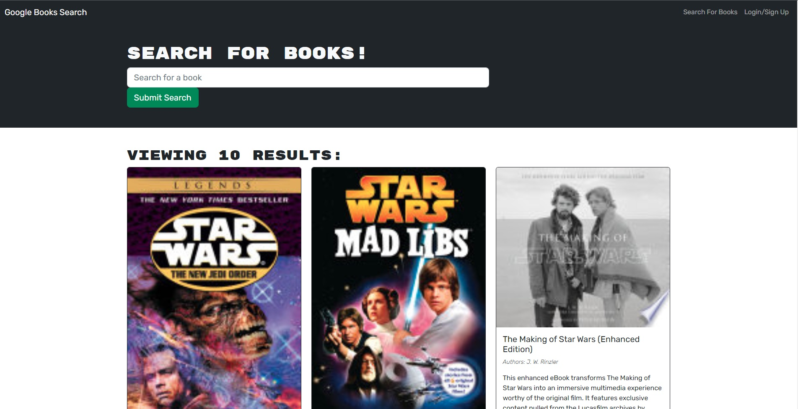

# bibliophiles-book-finder 

  ## Description
 This app refactors a fully functioning app using RESTful API into a GraphQL API using Apollo Server. Using the MERN stack technologies of MongoDB Database, Express.js, React.js front-end and Node.js.

  ## License
  
  [](https://opensource.org/licenses/MIT)
  
  ## Table of Contents
  
  - [Installation](#installation)
  - [Usage](#usage)
  - [License](#license)
  - [Contributing](#contributing)
  - [Questions](#questions)
  
  ## Installation
  
  Clone this repo to your repository. In order to run this application in your personal workspace you will need to have Node.js.

  Use these following commands:

  ```
  npm install

  npm develop
  ```
  
  ## Usage
  Visit the deployed live website at [Bookfinder](https://lad-booksearch.herokuapp.com/).


  On the main page is access to the book search and login and sign up.
   
  


  Loggin in and Signing up happen in a popup window.

  
  


  Searches can be perform whether you are logged in or not.

  


  Books can be saved and deleted from your account when logged in.

  
  
  


  ## Contributing
  
  No contribution to this repo
   
  ## Questions
  
  Any questions please contact me at: ladudrey@gmail.com. 
  More examples of my work are available at [GitHub](https://github.com/LDudrey).